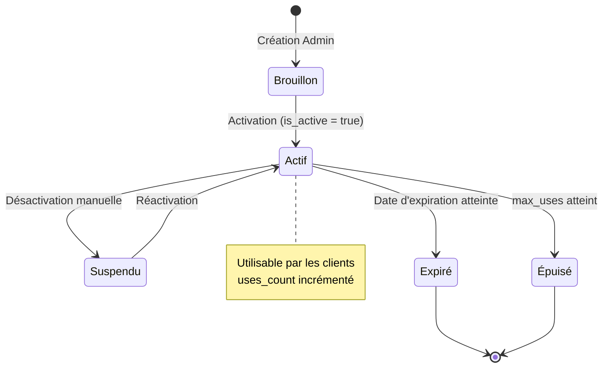

# 📋 Spécifications Complètes - Système de Codes Promo

**Date**: 2025-11-07
**Version**: 1.0
**Statut**: ✅ Implémenté (Base de données) | 🚧 À Implémenter (Frontend)
**Migration**: `20250107130000_add_promo_codes_system.sql`

---

## Table des Matières

1. [Vue d'Ensemble](#1-vue-densemble)
2. [Règles Métier](#2-règles-métier)
3. [Spécifications Fonctionnelles](#3-spécifications-fonctionnelles)
4. [User Stories](#4-user-stories)
5. [Architecture Technique](#5-architecture-technique)
6. [Impacts sur les Autres Systèmes](#6-impacts-sur-les-autres-systèmes)
7. [Interfaces Utilisateur](#7-interfaces-utilisateur)
8. [Scénarios d'Utilisation](#8-scénarios-dutilisation)
9. [Gestion des Erreurs](#9-gestion-des-erreurs)
10. [Analytics et Reporting](#10-analytics-et-reporting)
11. [Sécurité et Validation](#11-sécurité-et-validation)
12. [Évolutions Futures](#12-évolutions-futures)

---

## 1. Vue d'Ensemble

### 1.1 Objectif

Le système de codes promo permet à la plateforme Simone Paris de:
- **Acquérir de nouveaux clients** via des offres de bienvenue
- **Fidéliser les clients existants** avec des promotions ciblées
- **Stimuler les ventes** pendant les périodes creuses ou événements spéciaux
- **Soutenir les prestataires** sans impacter leur rémunération

### 1.2 Principe Fondamental

**La plateforme absorbe 100% du coût des réductions promotionnelles.**

Cette règle garantit que:
- ✅ Les prestataires reçoivent leur commission complète (calculée sur le prix original)
- ✅ Les clients bénéficient de réductions attractives
- ✅ La plateforme contrôle ses coûts marketing via des limites d'utilisation
- ✅ Le système reste transparent et équitable pour tous

### 1.3 Référence aux Spécifications Principales

Extrait des [specifications-simone-fusionnees.md](./specifications-simone-fusionnees.md):

> **Section 4.3 - Étape 3 : Paiement et Confirmation**
>
> "Le client finalise le paiement de manière sécurisée via Stripe. Il peut également appliquer un code promotionnel ou le solde d'une carte cadeau. Un récapitulatif détaillé est présenté avant validation."

> **Section 10.1 - Dashboard Admin**
>
> "**Promotions** : Les administrateurs peuvent créer des codes de réduction personnalisés (montant fixe ou pourcentage) avec des restrictions (dates, services, nombre d'utilisations)."

---

## 2. Règles Métier

### 2.1 Règles de Calcul Financier

#### R1: Commission Prestataire (CRITIQUE)
```
Commission Prestataire = (Prix Original du Service × Taux de Commission) - Frais
                       ≠ (Prix Après Réduction × Taux de Commission)
```

**Exemple**:
- Service: 100€
- Code promo: -20€ (20%)
- Client paie: 80€
- **Commission prestataire**: Calculée sur 100€, PAS sur 80€

#### R2: Coût Plateforme
```
Coût Marketing Plateforme = Montant de la Réduction
```

La plateforme absorbe la différence entre le prix original et le prix payé par le client.

#### R3: Calcul de Réduction

**Pour les réductions en pourcentage**:
```sql
discount_amount = MIN(
  service_amount × (discount_value / 100),
  max_discount_amount  -- Si défini
)
```

**Pour les réductions fixes**:
```sql
discount_amount = MIN(
  discount_value,
  service_amount  -- Ne peut pas être négatif
)
```

### 2.2 Règles de Validation

#### R4: Éligibilité du Code
Un code promo est valide si:
1. ✅ Le code existe dans la base de données
2. ✅ `is_active = true`
3. ✅ Date actuelle entre `valid_from` et `valid_until`
4. ✅ `uses_count < max_uses` (si `max_uses` défini)

#### R5: Éligibilité de l'Utilisateur
Un utilisateur peut utiliser un code si:
1. ✅ Nombre d'utilisations personnelles < `max_uses_per_user`
2. ✅ Si `first_booking_only = true` → aucune réservation précédente
3. ✅ Le montant de la commande ≥ `min_order_amount` (si défini)

#### R6: Éligibilité du Service
Un service est éligible si:
1. ✅ Si `specific_services` défini → `service_id` dans la liste
2. ✅ Si `specific_categories` défini → `category_id` dans la liste
3. ✅ Si les deux sont NULL → tous les services sont éligibles

#### R7: Restrictions de Cumul
- ❌ Un seul code promo par réservation
- ✅ Code promo + carte cadeau = possible (à implémenter séparément)
- ❌ Code promo + autre promotion automatique = non cumulable

### 2.3 Règles d'Incrémentation

#### R8: Compteurs d'Utilisation
Lors de l'application d'un code promo:
1. `promo_codes.uses_count` += 1
2. Créer une entrée dans `promo_code_usage`
3. Vérifier que `uses_count ≤ max_uses` avant validation

#### R9: Annulation de Réservation
Si une réservation avec code promo est annulée:
1. `promo_codes.uses_count` -= 1
2. Marquer l'entrée `promo_code_usage` comme annulée (ou supprimer)
3. Le client peut réutiliser le code (si `max_uses_per_user` le permet)

---

## 3. Spécifications Fonctionnelles

### 3.1 Types de Codes Promo

| Type | Description | Paramètres | Exemple |
|------|-------------|------------|---------|
| **Pourcentage** | Réduction en % du montant | `discount_value` = pourcentage | 20% de réduction |
| **Montant Fixe** | Réduction en euros | `discount_value` = montant | 10€ de réduction |
| **Pourcentage Plafonné** | % avec limite maximale | `discount_value` + `max_discount_amount` | 30% max 50€ |

### 3.2 Restrictions Disponibles

#### 3.2.1 Restrictions Temporelles
- **`valid_from`**: Date de début de validité (par défaut: NOW())
- **`valid_until`**: Date de fin de validité (nullable pour codes permanents)

#### 3.2.2 Restrictions d'Utilisation
- **`max_uses`**: Nombre total d'utilisations autorisées (tous utilisateurs confondus)
- **`max_uses_per_user`**: Nombre d'utilisations par utilisateur (par défaut: 1)
- **`uses_count`**: Compteur actuel d'utilisations (incrémenté automatiquement)

#### 3.2.3 Restrictions Commerciales
- **`min_order_amount`**: Montant minimum de commande requis
- **`first_booking_only`**: Réservé aux nouveaux clients (boolean)

#### 3.2.4 Restrictions de Service
- **`specific_services`**: Array d'IDs de services (NULL = tous services)
- **`specific_categories`**: Array d'IDs de catégories (NULL = toutes catégories)

### 3.3 Gestion du Cycle de Vie



### 3.4 Traçabilité et Audit

Chaque utilisation de code promo doit être tracée avec:
- **ID du code promo** utilisé
- **ID de la réservation** concernée
- **ID de l'utilisateur** qui a utilisé le code
- **Montant original** du service
- **Montant de la réduction** appliquée
- **Montant final** payé par le client
- **Date et heure** d'utilisation

---

## 4. User Stories

### 4.1 Client

**US-C1**: En tant que **nouveau client**, je veux utiliser un code promo de bienvenue pour bénéficier d'une réduction sur ma première réservation.

**Critères d'acceptation**:
- [ ] Je peux saisir un code promo dans le formulaire de réservation
- [ ] Le système valide le code en temps réel
- [ ] Le montant de la réduction est affiché clairement
- [ ] Le prix final (après réduction) est mis à jour instantanément
- [ ] Je vois un message de confirmation: "Code promo appliqué! Vous économisez XX€"

---

**US-C2**: En tant que **client**, je veux voir clairement le prix original et le prix réduit pour comprendre mon économie.

**Critères d'acceptation**:
- [ ] Le prix original est affiché barré
- [ ] Le prix réduit est affiché en vert et mis en valeur
- [ ] Le montant de l'économie est affiché: "Vous économisez XX€"
- [ ] Le récapitulatif de commande montre les deux prix

---

**US-C3**: En tant que **client**, je veux recevoir un message d'erreur clair si mon code promo est invalide.

**Critères d'acceptation**:
- [ ] Si le code n'existe pas: "Ce code promo n'existe pas"
- [ ] Si le code est expiré: "Ce code promo a expiré le DD/MM/YYYY"
- [ ] Si le code est épuisé: "Ce code promo a atteint sa limite d'utilisation"
- [ ] Si je l'ai déjà utilisé: "Vous avez déjà utilisé ce code promo"
- [ ] Si montant minimum non atteint: "Montant minimum requis: XX€"

---

**US-C4**: En tant que **client**, je veux pouvoir retirer un code promo pour en essayer un autre.

**Critères d'acceptation**:
- [ ] Un bouton "Retirer" est visible quand un code est appliqué
- [ ] Le prix revient au montant original après retrait
- [ ] Je peux saisir un nouveau code immédiatement

---

### 4.2 Administrateur

**US-A1**: En tant qu'**administrateur**, je veux créer un nouveau code promo avec des paramètres personnalisés.

**Critères d'acceptation**:
- [ ] Je peux saisir un code unique (lettres/chiffres, max 50 caractères)
- [ ] Je choisis le type de réduction (pourcentage ou montant fixe)
- [ ] Je définis la valeur de la réduction
- [ ] Je peux définir un plafond pour les réductions en pourcentage
- [ ] Je peux limiter le nombre total d'utilisations
- [ ] Je peux limiter le nombre d'utilisations par utilisateur
- [ ] Je peux définir une période de validité
- [ ] Je peux restreindre à certains services ou catégories
- [ ] Je peux réserver aux nouveaux clients uniquement

---

**US-A2**: En tant qu'**administrateur**, je veux voir l'historique d'utilisation de chaque code promo.

**Critères d'acceptation**:
- [ ] Je vois le nombre total d'utilisations
- [ ] Je vois le montant total de réduction accordée (coût plateforme)
- [ ] Je vois la liste des clients qui ont utilisé le code
- [ ] Je vois les dates d'utilisation
- [ ] Je peux filtrer par période
- [ ] Je peux exporter les données en CSV

---

**US-A3**: En tant qu'**administrateur**, je veux désactiver temporairement un code promo sans le supprimer.

**Critères d'acceptation**:
- [ ] Un toggle "Actif/Inactif" est disponible
- [ ] Les codes inactifs ne peuvent pas être utilisés par les clients
- [ ] Les codes inactifs restent visibles dans l'interface admin
- [ ] Je peux réactiver un code à tout moment

---

**US-A4**: En tant qu'**administrateur**, je veux voir le coût total des promotions pour la plateforme.

**Critères d'acceptation**:
- [ ] Dashboard avec KPIs: coût total, nombre de codes utilisés, économie moyenne par client
- [ ] Graphique d'évolution du coût sur le temps
- [ ] Comparaison avec le chiffre d'affaires généré
- [ ] ROI estimé des campagnes promotionnelles

---

### 4.3 Prestataire

**US-P1**: En tant que **prestataire**, je veux être assuré que les codes promo n'impactent pas ma rémunération.

**Critères d'acceptation**:
- [ ] Mon dashboard affiche clairement que ma commission est calculée sur le prix original
- [ ] Dans les détails de transaction, je vois:
  - Prix original du service
  - Code promo utilisé (si applicable)
  - Montant payé par le client
  - **Ma commission (calculée sur le prix original)**
- [ ] Une info-bulle explique: "Votre commission est toujours calculée sur le prix original. La réduction est prise en charge par la plateforme."

---

**US-P2**: En tant que **prestataire**, je veux voir quelles réservations ont utilisé un code promo.

**Critères d'acceptation**:
- [ ] Un badge "Code promo" apparaît sur les réservations concernées
- [ ] Je peux filtrer mes réservations par "Avec code promo"
- [ ] Les statistiques montrent: "X% de vos clients ont utilisé un code promo"

---

## 5. Architecture Technique

### 5.1 Modèle de Données

#### Table: `promo_codes`

```sql
CREATE TABLE promo_codes (
  -- Identité
  id                    BIGINT PRIMARY KEY GENERATED ALWAYS AS IDENTITY,
  code                  VARCHAR(50) NOT NULL UNIQUE,
  description           TEXT,

  -- Configuration de réduction
  discount_type         VARCHAR(20) NOT NULL CHECK (discount_type IN ('percentage', 'fixed_amount')),
  discount_value        DECIMAL(10, 2) NOT NULL CHECK (discount_value > 0),
  max_discount_amount   DECIMAL(10, 2),

  -- Limites d'utilisation
  max_uses              INT,
  uses_count            INT DEFAULT 0 NOT NULL,
  max_uses_per_user     INT DEFAULT 1,

  -- Période de validité
  valid_from            TIMESTAMP DEFAULT NOW(),
  valid_until           TIMESTAMP,

  -- Restrictions commerciales
  min_order_amount      DECIMAL(10, 2),
  first_booking_only    BOOLEAN DEFAULT false,

  -- Restrictions de service
  specific_services     BIGINT[],
  specific_categories   BIGINT[],

  -- Statut
  is_active             BOOLEAN DEFAULT true,

  -- Audit
  created_by            UUID REFERENCES profiles(id),
  created_at            TIMESTAMP DEFAULT NOW(),
  updated_at            TIMESTAMP DEFAULT NOW()
);
```

**Index recommandés**:
```sql
CREATE INDEX idx_promo_codes_code ON promo_codes(code);
CREATE INDEX idx_promo_codes_active ON promo_codes(is_active) WHERE is_active = true;
CREATE INDEX idx_promo_codes_validity ON promo_codes(valid_from, valid_until);
```

#### Table: `promo_code_usage`

```sql
CREATE TABLE promo_code_usage (
  id                BIGINT PRIMARY KEY GENERATED ALWAYS AS IDENTITY,
  promo_code_id     BIGINT NOT NULL REFERENCES promo_codes(id),
  booking_id        BIGINT NOT NULL REFERENCES appointment_bookings(id),
  user_id           UUID NOT NULL REFERENCES auth.users(id),

  original_amount   DECIMAL(10, 2) NOT NULL,
  discount_amount   DECIMAL(10, 2) NOT NULL,
  final_amount      DECIMAL(10, 2) NOT NULL,

  used_at           TIMESTAMP DEFAULT NOW(),

  UNIQUE(promo_code_id, booking_id)
);
```

**Index recommandés**:
```sql
CREATE INDEX idx_promo_usage_code ON promo_code_usage(promo_code_id);
CREATE INDEX idx_promo_usage_user ON promo_code_usage(user_id);
CREATE INDEX idx_promo_usage_booking ON promo_code_usage(booking_id);
CREATE INDEX idx_promo_usage_date ON promo_code_usage(used_at);
```

#### Extension: `appointment_bookings`

```sql
ALTER TABLE appointment_bookings ADD COLUMN
  service_amount_original DECIMAL(10, 2),
  promo_code_id           BIGINT REFERENCES promo_codes(id),
  promo_discount_amount   DECIMAL(10, 2) DEFAULT 0;

-- Contrainte de cohérence
ALTER TABLE appointment_bookings ADD CONSTRAINT check_promo_amounts CHECK (
  (promo_code_id IS NULL AND promo_discount_amount = 0) OR
  (promo_code_id IS NOT NULL AND service_amount_original IS NOT NULL AND promo_discount_amount > 0)
);
```

### 5.2 Fonction de Validation

```sql
CREATE OR REPLACE FUNCTION validate_promo_code(
  p_code VARCHAR(50),
  p_user_id UUID,
  p_service_id BIGINT,
  p_service_amount DECIMAL(10, 2)
)
RETURNS TABLE (
  is_valid BOOLEAN,
  promo_id BIGINT,
  discount_amount DECIMAL(10, 2),
  final_amount DECIMAL(10, 2),
  error_message TEXT
) AS $$
DECLARE
  v_promo promo_codes%ROWTYPE;
  v_user_uses_count INT;
  v_has_previous_booking BOOLEAN;
  v_discount DECIMAL(10, 2);
  v_final DECIMAL(10, 2);
  v_service services%ROWTYPE;
BEGIN
  -- 1. Vérifier que le code existe et est actif
  SELECT * INTO v_promo FROM promo_codes WHERE code = p_code AND is_active = true;

  IF NOT FOUND THEN
    RETURN QUERY SELECT false, NULL::BIGINT, 0::DECIMAL, p_service_amount, 'Code promo invalide ou inactif';
    RETURN;
  END IF;

  -- 2. Vérifier la période de validité
  IF NOW() < v_promo.valid_from THEN
    RETURN QUERY SELECT false, NULL::BIGINT, 0::DECIMAL, p_service_amount,
      'Ce code promo n''est pas encore valide. Valide à partir du ' || TO_CHAR(v_promo.valid_from, 'DD/MM/YYYY');
    RETURN;
  END IF;

  IF v_promo.valid_until IS NOT NULL AND NOW() > v_promo.valid_until THEN
    RETURN QUERY SELECT false, NULL::BIGINT, 0::DECIMAL, p_service_amount,
      'Ce code promo a expiré le ' || TO_CHAR(v_promo.valid_until, 'DD/MM/YYYY');
    RETURN;
  END IF;

  -- 3. Vérifier le nombre total d'utilisations
  IF v_promo.max_uses IS NOT NULL AND v_promo.uses_count >= v_promo.max_uses THEN
    RETURN QUERY SELECT false, NULL::BIGINT, 0::DECIMAL, p_service_amount,
      'Ce code promo a atteint sa limite d''utilisation';
    RETURN;
  END IF;

  -- 4. Vérifier les utilisations par utilisateur
  SELECT COUNT(*) INTO v_user_uses_count
  FROM promo_code_usage
  WHERE promo_code_id = v_promo.id AND user_id = p_user_id;

  IF v_user_uses_count >= v_promo.max_uses_per_user THEN
    RETURN QUERY SELECT false, NULL::BIGINT, 0::DECIMAL, p_service_amount,
      'Vous avez déjà utilisé ce code promo le nombre maximum de fois autorisé';
    RETURN;
  END IF;

  -- 5. Vérifier first_booking_only
  IF v_promo.first_booking_only THEN
    SELECT EXISTS (
      SELECT 1 FROM appointment_bookings
      WHERE client_id = p_user_id
        AND status IN ('completed', 'completed_by_contractor')
    ) INTO v_has_previous_booking;

    IF v_has_previous_booking THEN
      RETURN QUERY SELECT false, NULL::BIGINT, 0::DECIMAL, p_service_amount,
        'Ce code promo est réservé aux nouveaux clients uniquement';
      RETURN;
    END IF;
  END IF;

  -- 6. Vérifier le montant minimum
  IF v_promo.min_order_amount IS NOT NULL AND p_service_amount < v_promo.min_order_amount THEN
    RETURN QUERY SELECT false, NULL::BIGINT, 0::DECIMAL, p_service_amount,
      'Montant minimum requis : ' || v_promo.min_order_amount || '€';
    RETURN;
  END IF;

  -- 7. Vérifier les services spécifiques
  IF v_promo.specific_services IS NOT NULL AND CARDINALITY(v_promo.specific_services) > 0 THEN
    IF NOT (p_service_id = ANY(v_promo.specific_services)) THEN
      RETURN QUERY SELECT false, NULL::BIGINT, 0::DECIMAL, p_service_amount,
        'Ce code promo n''est pas valable pour ce service';
      RETURN;
    END IF;
  END IF;

  -- 8. Vérifier les catégories spécifiques
  IF v_promo.specific_categories IS NOT NULL AND CARDINALITY(v_promo.specific_categories) > 0 THEN
    SELECT * INTO v_service FROM services WHERE id = p_service_id;

    IF NOT (v_service.category_id = ANY(v_promo.specific_categories)) THEN
      RETURN QUERY SELECT false, NULL::BIGINT, 0::DECIMAL, p_service_amount,
        'Ce code promo n''est pas valable pour cette catégorie de service';
      RETURN;
    END IF;
  END IF;

  -- 9. Calculer la réduction
  IF v_promo.discount_type = 'percentage' THEN
    v_discount := p_service_amount * (v_promo.discount_value / 100);

    -- Appliquer le plafond si défini
    IF v_promo.max_discount_amount IS NOT NULL THEN
      v_discount := LEAST(v_discount, v_promo.max_discount_amount);
    END IF;
  ELSE -- fixed_amount
    v_discount := LEAST(v_promo.discount_value, p_service_amount);
  END IF;

  v_final := p_service_amount - v_discount;

  -- 10. Retourner le résultat valide
  RETURN QUERY SELECT true, v_promo.id, v_discount, v_final, NULL::TEXT;
END;
$$ LANGUAGE plpgsql;
```

### 5.3 Vues Financières Mises à Jour

#### Vue: `contractor_financial_summary`

**Modification critique**: Utiliser `COALESCE(service_amount_original, service_amount)` pour les calculs de commission.

```sql
CREATE OR REPLACE VIEW contractor_financial_summary AS
SELECT
  c.id AS contractor_id,
  -- Commission calculée sur le montant ORIGINAL
  COALESCE(SUM(
    CASE
      WHEN b.status IN ('completed', 'completed_by_contractor')
      THEN
        (COALESCE(b.service_amount_original, b.service_amount) -
         (COALESCE(b.service_amount_original, b.service_amount) * c.commission_rate / 100)) -
        (CASE WHEN c.contractor_pays_stripe_fees THEN b.stripe_fee_service ELSE 0 END)
      ELSE 0
    END
  ), 0) AS total_revenue_service,

  -- Statistiques sur les codes promo
  COUNT(CASE WHEN b.promo_code_id IS NOT NULL THEN 1 END) AS bookings_with_promo,
  SUM(CASE WHEN b.promo_code_id IS NOT NULL THEN b.promo_discount_amount ELSE 0 END) AS total_promo_absorbed_by_platform

FROM contractors c
LEFT JOIN appointment_bookings b ON c.id = b.contractor_id
GROUP BY c.id;
```

#### Vue: `contractor_transaction_details`

```sql
CREATE OR REPLACE VIEW contractor_transaction_details AS
SELECT
  b.id AS booking_id,
  b.contractor_id,
  b.client_id,
  b.service_id,
  s.name AS service_name,

  -- Montants
  COALESCE(b.service_amount_original, b.service_amount) AS original_amount,
  b.promo_discount_amount,
  b.service_amount AS client_paid_amount,

  -- Code promo
  b.promo_code_id,
  pc.code AS promo_code_used,

  -- Commission prestataire (sur montant original)
  (COALESCE(b.service_amount_original, b.service_amount) *
   (100 - c.commission_rate) / 100) AS contractor_gross_earning,

  -- Frais
  CASE WHEN c.contractor_pays_stripe_fees
    THEN b.stripe_fee_service
    ELSE 0
  END AS contractor_stripe_fees,

  -- Net prestataire
  (COALESCE(b.service_amount_original, b.service_amount) *
   (100 - c.commission_rate) / 100) -
  CASE WHEN c.contractor_pays_stripe_fees
    THEN b.stripe_fee_service
    ELSE 0
  END AS contractor_net_earning,

  b.scheduled_at,
  b.completed_at,
  b.status

FROM appointment_bookings b
JOIN contractors c ON b.contractor_id = c.id
JOIN services s ON b.service_id = s.id
LEFT JOIN promo_codes pc ON b.promo_code_id = pc.id
ORDER BY b.scheduled_at DESC;
```

### 5.4 Triggers et Automatisations

#### Trigger: Incrémenter `uses_count`

```sql
CREATE OR REPLACE FUNCTION increment_promo_usage()
RETURNS TRIGGER AS $$
BEGIN
  -- Incrémenter le compteur global
  UPDATE promo_codes
  SET uses_count = uses_count + 1,
      updated_at = NOW()
  WHERE id = NEW.promo_code_id;

  -- Créer l'entrée de traçabilité
  INSERT INTO promo_code_usage (
    promo_code_id,
    booking_id,
    user_id,
    original_amount,
    discount_amount,
    final_amount
  ) VALUES (
    NEW.promo_code_id,
    NEW.id,
    NEW.client_id,
    NEW.service_amount_original,
    NEW.promo_discount_amount,
    NEW.service_amount
  );

  RETURN NEW;
END;
$$ LANGUAGE plpgsql;

CREATE TRIGGER trg_promo_usage_on_booking
  AFTER INSERT ON appointment_bookings
  FOR EACH ROW
  WHEN (NEW.promo_code_id IS NOT NULL)
  EXECUTE FUNCTION increment_promo_usage();
```

#### Trigger: Décrémenter `uses_count` en cas d'annulation

```sql
CREATE OR REPLACE FUNCTION decrement_promo_usage()
RETURNS TRIGGER AS $$
BEGIN
  IF OLD.promo_code_id IS NOT NULL AND NEW.status IN ('cancelled', 'cancelled_by_contractor') THEN
    -- Décrémenter le compteur
    UPDATE promo_codes
    SET uses_count = uses_count - 1,
        updated_at = NOW()
    WHERE id = OLD.promo_code_id;

    -- Marquer l'utilisation comme annulée (ou supprimer)
    DELETE FROM promo_code_usage
    WHERE booking_id = OLD.id AND promo_code_id = OLD.promo_code_id;
  END IF;

  RETURN NEW;
END;
$$ LANGUAGE plpgsql;

CREATE TRIGGER trg_promo_usage_on_cancel
  AFTER UPDATE ON appointment_bookings
  FOR EACH ROW
  WHEN (OLD.status NOT IN ('cancelled', 'cancelled_by_contractor')
    AND NEW.status IN ('cancelled', 'cancelled_by_contractor'))
  EXECUTE FUNCTION decrement_promo_usage();
```

---

## 6. Impacts sur les Autres Systèmes

### 6.1 Impact sur le Système de Réservation

**Fichier concerné**: `app/booking/checkout/page.tsx` (à créer/modifier)

#### Changements requis:

1. **Ajout d'un champ de saisie de code promo**
   ```tsx
   <input
     type="text"
     placeholder="Code promo"
     value={promoCode}
     onChange={(e) => setPromoCode(e.target.value.toUpperCase())}
   />
   <button onClick={handleApplyPromo}>Appliquer</button>
   ```

2. **Validation en temps réel**
   ```typescript
   const handleApplyPromo = async () => {
     const { data, error } = await supabase.rpc('validate_promo_code', {
       p_code: promoCode,
       p_user_id: userId,
       p_service_id: serviceId,
       p_service_amount: serviceAmount
     });

     if (data[0].is_valid) {
       setDiscount(data[0].discount_amount);
       setFinalAmount(data[0].final_amount);
       setPromoId(data[0].promo_id);
     } else {
       showError(data[0].error_message);
     }
   };
   ```

3. **Affichage des prix**
   ```tsx
   {discount > 0 && (
     <>
       <div className="price-original">
         <del>{serviceAmount}€</del>
       </div>
       <div className="price-discount">
         {finalAmount}€
         <span className="savings">Vous économisez {discount}€!</span>
       </div>
     </>
   )}
   ```

4. **Création de la réservation**
   ```typescript
   const bookingData = {
     contractor_id: contractorId,
     client_id: userId,
     service_id: serviceId,
     service_amount_original: discount > 0 ? serviceAmount : null,
     promo_code_id: discount > 0 ? promoId : null,
     promo_discount_amount: discount,
     service_amount: finalAmount,
     // ... autres champs
   };
   ```

### 6.2 Impact sur le Système de Paiement Stripe

**Edge Function concernée**: `supabase/functions/create-payment-intent/index.ts`

#### Changements requis:

1. **Calcul du montant à charger**
   ```typescript
   // Le montant à charger à Stripe est le montant APRÈS réduction
   const paymentIntent = await stripe.paymentIntents.create({
     amount: Math.round(booking.service_amount * 100), // En centimes
     currency: 'eur',
     metadata: {
       booking_id: booking.id,
       contractor_id: booking.contractor_id,
       service_amount_original: booking.service_amount_original || booking.service_amount,
       promo_code_id: booking.promo_code_id,
       promo_discount: booking.promo_discount_amount
     }
   });
   ```

2. **Calcul de la commission plateforme**
   ```typescript
   // La commission est calculée sur le montant ORIGINAL
   const originalAmount = booking.service_amount_original || booking.service_amount;
   const platformCommission = originalAmount * (contractor.commission_rate / 100);

   // Le transfer au prestataire = montant payé - commission plateforme
   const transferAmount = booking.service_amount - platformCommission;
   ```

### 6.3 Impact sur le Dashboard Administrateur

**Fichier concerné**: `app/admin/promos/page.tsx` (à créer)

#### Fonctionnalités à implémenter:

1. **Liste des codes promo**
   - Table avec toutes les colonnes importantes
   - Filtres: actif/inactif, type, expiré/valide
   - Actions: éditer, désactiver, dupliquer, supprimer

2. **Création/Édition de code promo**
   - Formulaire avec tous les champs
   - Validation côté client
   - Prévisualisation du code

3. **Analytics**
   - Nombre total de codes
   - Codes actifs vs inactifs
   - Top 10 codes les plus utilisés
   - Coût total pour la plateforme
   - ROI estimé

4. **Détails d'un code promo**
   - Statistiques d'utilisation
   - Liste des utilisateurs ayant utilisé le code
   - Graphique d'utilisation dans le temps
   - Export CSV

### 6.4 Impact sur le Dashboard Prestataire

**Fichier concerné**: `app/contractor/dashboard/page.tsx`

#### Changements requis:

1. **Widget d'information**
   ```tsx
   <InfoBox icon="🎟️" title="Codes Promo">
     <p>
       {bookingsWithPromo} de vos réservations ont utilisé un code promo.
       <InfoTooltip>
         Votre commission est toujours calculée sur le prix original du service.
         La réduction est entièrement prise en charge par la plateforme.
       </InfoTooltip>
     </p>
   </InfoBox>
   ```

2. **Détails de transaction**
   ```tsx
   {booking.promo_code_id && (
     <div className="promo-info">
       <Badge variant="success">Code promo: {booking.promo_code_used}</Badge>
       <div className="amounts">
         <div>Prix original: {booking.original_amount}€</div>
         <div>Réduction client: -{booking.promo_discount_amount}€</div>
         <div>Client a payé: {booking.client_paid_amount}€</div>
         <div className="highlight">
           Votre commission: {booking.contractor_gross_earning}€
           <small>(calculée sur {booking.original_amount}€)</small>
         </div>
       </div>
     </div>
   )}
   ```

### 6.5 Impact sur les Notifications

#### Email de confirmation de réservation (Client)

**Template**: `emails/booking-confirmation.html`

```html
<tr>
  <td>Service:</td>
  <td>{{ service_name }}</td>
</tr>

<tr>
  <td>Prix original:</td>
  <td><del>{{ service_amount_original }}€</del></td>
</tr>
<tr>
  <td>Code promo ({{ promo_code }}):</td>
  <td class="discount">-{{ promo_discount_amount }}€</td>
</tr>
<tr class="total">
  <td>Montant payé:</td>
  <td>{{ service_amount }}€</td>
</tr>
<tr>
  <td colspan="2" class="savings">
    🎉 Vous avez économisé {{ promo_discount_amount }}€!
  </td>
</tr>

<tr class="total">
  <td>Montant:</td>
  <td>{{ service_amount }}€</td>
</tr>

```

#### Email de nouvelle réservation (Prestataire)

```html
<tr>
  <td>Montant:</td>
  <td>{{ service_amount }}€</td>
</tr>

<tr>
  <td colspan="2" class="info-box">
    ℹ️ Le client a utilisé un code promo ({{ promo_code }}).
    Votre commission reste calculée sur le prix original ({{ service_amount_original }}€).
  </td>
</tr>

```

### 6.6 Impact sur les Edge Functions

#### Nouvelle Edge Function: `regularize-promo-commission`

**Fichier**: `supabase/functions/regularize-promo-commission/index.ts`

Cette fonction vérifie et corrige les calculs de commission en cas d'incohérence.

```typescript
import { serve } from 'https://deno.land/std@0.177.0/http/server.ts';
import { createClient } from 'https://esm.sh/@supabase/supabase-js@2';

serve(async (req) => {
  const supabase = createClient(
    Deno.env.get('SUPABASE_URL')!,
    Deno.env.get('SUPABASE_SERVICE_ROLE_KEY')!
  );

  // Récupérer toutes les réservations avec code promo
  const { data: bookings, error } = await supabase
    .from('appointment_bookings')
    .select('id, service_amount, service_amount_original, promo_discount_amount')
    .not('promo_code_id', 'is', null);

  const corrections = [];

  for (const booking of bookings) {
    // Vérifier la cohérence
    const expectedAmount = booking.service_amount_original - booking.promo_discount_amount;

    if (Math.abs(expectedAmount - booking.service_amount) > 0.01) {
      corrections.push({
        booking_id: booking.id,
        issue: 'Incohérence montant',
        current_amount: booking.service_amount,
        expected_amount: expectedAmount
      });
    }
  }

  return new Response(JSON.stringify({ corrections }), {
    headers: { 'Content-Type': 'application/json' }
  });
});
```

---

## 7. Interfaces Utilisateur

### 7.1 Interface Client - Application du Code Promo

```
┌─────────────────────────────────────────────────────┐
│  Récapitulatif de votre réservation                 │
├─────────────────────────────────────────────────────┤
│                                                      │
│  Service: Massage Suédois 60 min                    │
│  Prestataire: Marie Dupont                          │
│  Date: Samedi 15 nov 2025, 14h00                    │
│                                                      │
│  ┌─────────────────────────────────────────────┐   │
│  │ Code Promo                                   │   │
│  │ ┌──────────────────────┐  ┌──────────────┐ │   │
│  │ │ BIENVENUE20          │  │  Appliquer   │ │   │
│  │ └──────────────────────┘  └──────────────┘ │   │
│  └─────────────────────────────────────────────┘   │
│                                                      │
│  ✅ Code promo appliqué! Vous économisez 20€        │
│                                                      │
│  Prix:                              100,00€         │
│  Réduction (BIENVENUE20):           -20,00€         │
│  ━━━━━━━━━━━━━━━━━━━━━━━━━━━━━━━━━━━━━━━━━        │
│  Total à payer:                      80,00€         │
│                                                      │
│  [ Retirer le code promo ]                          │
│                                                      │
│  ┌──────────────────────────────────────────┐      │
│  │         Payer 80,00€                      │      │
│  └──────────────────────────────────────────┘      │
└─────────────────────────────────────────────────────┘
```

### 7.2 Interface Admin - Création de Code Promo

```
┌────────────────────────────────────────────────────────────┐
│  Créer un nouveau code promo                               │
├────────────────────────────────────────────────────────────┤
│                                                             │
│  Informations de base                                      │
│  ┌──────────────────────────────────────────────────────┐ │
│  │ Code *                                                │ │
│  │ ┌──────────────────────────────────────────────────┐ │ │
│  │ │ NOEL2024                                          │ │ │
│  │ └──────────────────────────────────────────────────┘ │ │
│  │ ℹ️ Lettres et chiffres uniquement, max 50 caractères │ │
│  └──────────────────────────────────────────────────────┘ │
│                                                             │
│  ┌──────────────────────────────────────────────────────┐ │
│  │ Description                                           │ │
│  │ ┌──────────────────────────────────────────────────┐ │ │
│  │ │ Promotion de Noël 2024: 30% de réduction         │ │ │
│  │ └──────────────────────────────────────────────────┘ │ │
│  └──────────────────────────────────────────────────────┘ │
│                                                             │
│  Type de réduction                                         │
│  ○ Pourcentage    ● Montant fixe                           │
│                                                             │
│  ┌────────────────────────┐  ┌─────────────────────────┐  │
│  │ Valeur *               │  │ Plafond (optionnel)     │  │
│  │ ┌────────────────────┐ │  │ ┌─────────────────────┐ │  │
│  │ │ 30               % │ │  │ │ 50              €   │ │  │
│  │ └────────────────────┘ │  │ └─────────────────────┘ │  │
│  └────────────────────────┘  └─────────────────────────┘  │
│                                                             │
│  Période de validité                                       │
│  ┌────────────────────────┐  ┌─────────────────────────┐  │
│  │ Du                     │  │ Au                      │  │
│  │ ┌────────────────────┐ │  │ ┌─────────────────────┐ │  │
│  │ │ 01/12/2024         │ │  │ │ 31/12/2024          │ │  │
│  │ └────────────────────┘ │  │ └─────────────────────┘ │  │
│  └────────────────────────┘  └─────────────────────────┘  │
│                                                             │
│  Limites d'utilisation                                     │
│  ┌────────────────────────┐  ┌─────────────────────────┐  │
│  │ Utilisations max       │  │ Par utilisateur         │  │
│  │ ┌────────────────────┐ │  │ ┌─────────────────────┐ │  │
│  │ │ 500                │ │  │ │ 1                   │ │  │
│  │ └────────────────────┘ │  │ └─────────────────────┘ │  │
│  └────────────────────────┘  └─────────────────────────┘  │
│                                                             │
│  Restrictions                                              │
│  ┌──────────────────────────────────────────────────────┐ │
│  │ ☑ Nouveaux clients uniquement                        │ │
│  │ ☐ Montant minimum: [____] €                          │ │
│  │ ☐ Services spécifiques: [Sélectionner...]           │ │
│  │ ☐ Catégories spécifiques: [Sélectionner...]         │ │
│  └──────────────────────────────────────────────────────┘ │
│                                                             │
│  Prévisualisation                                          │
│  ┌──────────────────────────────────────────────────────┐ │
│  │ Pour un service de 100€:                             │ │
│  │   - Réduction: 30€                                   │ │
│  │   - Client paie: 70€                                 │ │
│  │   - Coût plateforme: 30€                             │ │
│  │                                                       │ │
│  │ Pour un service de 200€:                             │ │
│  │   - Réduction: 50€ (plafonné)                        │ │
│  │   - Client paie: 150€                                │ │
│  │   - Coût plateforme: 50€                             │ │
│  └──────────────────────────────────────────────────────┘ │
│                                                             │
│  ┌──────────────┐  ┌──────────────┐                       │
│  │   Annuler    │  │    Créer     │                       │
│  └──────────────┘  └──────────────┘                       │
└────────────────────────────────────────────────────────────┘
```

### 7.3 Interface Admin - Analytics des Codes Promo

```
┌────────────────────────────────────────────────────────────────┐
│  Analytics - Codes Promo                                       │
├────────────────────────────────────────────────────────────────┤
│                                                                 │
│  Vue d'ensemble                                                │
│  ┌─────────────┐  ┌─────────────┐  ┌─────────────┐           │
│  │ Codes actifs│  │ Utilisations│  │ Coût total  │           │
│  │     12      │  │     347     │  │   4.580€    │           │
│  └─────────────┘  └─────────────┘  └─────────────┘           │
│                                                                 │
│  Top 5 codes les plus utilisés                                │
│  ┌──────────────────────────────────────────────────────────┐ │
│  │ Code          Utilisations   Coût Platform    Taux conv. │ │
│  ├──────────────────────────────────────────────────────────┤ │
│  │ BIENVENUE20        127         2.540€          8.2%     │ │
│  │ SIMONE10            89           890€          5.1%     │ │
│  │ NOEL2024            68         2.380€          4.3%     │ │
│  │ PAQUES15            42           630€          2.9%     │ │
│  │ REFERRAL20          21           420€          1.5%     │ │
│  └──────────────────────────────────────────────────────────┘ │
│                                                                 │
│  Évolution du coût plateforme                                 │
│  ┌──────────────────────────────────────────────────────────┐ │
│  │                                                           │ │
│  │  5000€ ┤                                        ●        │ │
│  │  4000€ ┤                              ●       ╱          │ │
│  │  3000€ ┤                    ●       ╱       ╱           │ │
│  │  2000€ ┤          ●       ╱       ╱                     │ │
│  │  1000€ ┤  ●     ╱       ╱                               │ │
│  │     0€ ┼────────────────────────────────────────────    │ │
│  │        Jan  Fév  Mar  Avr  Mai  Jun  Jul  Aoû  Sep     │ │
│  └──────────────────────────────────────────────────────────┘ │
│                                                                 │
│  ROI Estimé                                                   │
│  ┌──────────────────────────────────────────────────────────┐ │
│  │ CA généré via promos:        47.890€                     │ │
│  │ Coût des promos:              4.580€                     │ │
│  │ ━━━━━━━━━━━━━━━━━━━━━━━━━━━━━━━━━━                      │ │
│  │ ROI:                          945%                       │ │
│  └──────────────────────────────────────────────────────────┘ │
│                                                                 │
│  [📥 Exporter en CSV]                                         │
└────────────────────────────────────────────────────────────────┘
```

### 7.4 Interface Prestataire - Détails de Transaction

```
┌─────────────────────────────────────────────────────┐
│  Réservation #12847                                 │
├─────────────────────────────────────────────────────┤
│                                                      │
│  Client: Sophie Martin                              │
│  Service: Massage Deep Tissue 90min                 │
│  Date: 12 nov 2024, 15h00                           │
│  Statut: ✅ Terminée                                │
│                                                      │
│  🎟️ Code promo utilisé: BIENVENUE20                │
│                                                      │
│  Détails financiers                                 │
│  ┌─────────────────────────────────────────────┐   │
│  │ Prix original du service:       120,00€     │   │
│  │ Réduction client (20%):         -24,00€     │   │
│  │ Montant payé par le client:      96,00€     │   │
│  │                                              │   │
│  │ Commission plateforme (20%):    -24,00€     │   │
│  │ ━━━━━━━━━━━━━━━━━━━━━━━━━━━━━━━━━━━━━━━    │   │
│  │ Votre revenu brut:               96,00€     │   │
│  │                                              │   │
│  │ ℹ️ Votre commission est calculée sur        │   │
│  │    le prix original (120€), pas sur         │   │
│  │    le prix réduit. La réduction est         │   │
│  │    entièrement prise en charge par la       │   │
│  │    plateforme.                               │   │
│  └─────────────────────────────────────────────┘   │
│                                                      │
│  Paiement: Carte bancaire (Visa ****1234)          │
│  Pourboire: 10,00€                                  │
│                                                      │
└─────────────────────────────────────────────────────┘
```

---

## 8. Scénarios d'Utilisation

### 8.1 Scénario 1: Nouveau Client avec Code de Bienvenue

**Contexte**: Marie découvre Simone Paris et veut réserver son premier massage.

**Étapes**:

1. Marie navigue sur le site et choisit "Massage Suédois 60min" à 80€
2. Elle crée un compte (c'est sa première connexion)
3. Sur la page de paiement, elle voit un champ "Code promo"
4. Elle entre "BIENVENUE20" (20% de réduction pour nouveaux clients)
5. Le système valide:
   - ✅ Code existe et est actif
   - ✅ Dans la période de validité
   - ✅ Marie n'a aucune réservation précédente
   - ✅ Pas de restriction de service
6. Le prix est mis à jour:
   - Prix original: ~~80€~~
   - Réduction: -16€
   - **Prix final: 64€**
7. Marie confirme et paie 64€ via Stripe
8. En base de données:
   ```sql
   INSERT INTO appointment_bookings (
     service_amount_original: 80.00,
     promo_code_id: 1,
     promo_discount_amount: 16.00,
     service_amount: 64.00
   )
   ```
9. Le prestataire reçoit une commission calculée sur 80€ (pas 64€)
10. La plateforme absorbe les 16€ de réduction

**Résultat**:
- ✅ Marie économise 16€
- ✅ Le prestataire reçoit sa commission complète (80€ × 80% = 64€)
- ❌ La plateforme perd 16€ en marketing

### 8.2 Scénario 2: Code Promo avec Plafond

**Contexte**: Jean réserve un service cher avec un code promo plafonné.

**Étapes**:

1. Jean choisit "Soin Premium Visage" à 200€
2. Il entre le code "NOEL2024" (30% de réduction, max 50€)
3. Le système calcule:
   ```
   Réduction théorique = 200€ × 30% = 60€
   Réduction plafonnée = MIN(60€, 50€) = 50€
   ```
4. Prix affiché:
   - Prix original: ~~200€~~
   - Réduction: -50€ (30%, max 50€)
   - **Prix final: 150€**
5. Jean paie 150€
6. Le prestataire reçoit une commission sur 200€

**Résultat**:
Le plafond protège la plateforme contre des réductions trop élevées.

### 8.3 Scénario 3: Code Invalide - Message d'Erreur

**Contexte**: Sophie essaie d'utiliser un code expiré.

**Étapes**:

1. Sophie choisit un service à 100€
2. Elle entre "SUMMER2024"
3. Le système vérifie et trouve:
   - Code existe: ✅
   - Actif: ✅
   - Valid_until: 31/08/2024
   - Date actuelle: 07/11/2024 → **EXPIRÉ**
4. Message d'erreur affiché:
   ```
   ❌ Ce code promo a expiré le 31/08/2024
   ```
5. Le prix reste à 100€
6. Sophie peut essayer un autre code

**Autres messages d'erreur possibles**:
- "Code promo invalide ou inactif"
- "Ce code promo a atteint sa limite d'utilisation"
- "Vous avez déjà utilisé ce code promo"
- "Montant minimum requis: 50€"
- "Ce code promo n'est pas valable pour ce service"

### 8.4 Scénario 4: Admin Crée une Campagne Promo

**Contexte**: L'admin veut créer un code pour la Saint-Valentin.

**Étapes**:

1. L'admin se connecte au dashboard
2. Navigation: Admin > Promotions > Nouveau code promo
3. Remplit le formulaire:
   - Code: `VALENTIN25`
   - Description: "Offre Saint-Valentin: 25% sur tous les massages duo"
   - Type: Pourcentage
   - Valeur: 25
   - Plafond: 40€
   - Validité: 01/02/2025 → 14/02/2025
   - Max utilisations: 200
   - Par utilisateur: 1
   - Catégories: [Massage Duo]
4. Prévisualisation:
   - Service 120€ → Réduction 30€ → Client paie 90€
   - Service 200€ → Réduction 40€ (plafonné) → Client paie 160€
5. L'admin valide
6. Le code est créé en base avec `is_active = true`
7. Les clients peuvent immédiatement l'utiliser

**Suivi**:
- L'admin peut voir en temps réel le nombre d'utilisations
- Après 200 utilisations, le code devient automatiquement indisponible
- L'admin peut désactiver manuellement le code avant la date d'expiration

### 8.5 Scénario 5: Annulation avec Code Promo

**Contexte**: Un client annule une réservation qui avait un code promo.

**Étapes**:

1. Client: Réservation #12345 avec BIENVENUE20 (100€ → 80€)
2. Base de données:
   ```sql
   promo_codes.uses_count = 127
   promo_code_usage: entrée créée pour cette réservation
   ```
3. Le client annule la réservation 24h avant
4. Le trigger `trg_promo_usage_on_cancel` s'exécute:
   ```sql
   UPDATE promo_codes SET uses_count = 126 WHERE id = 1;
   DELETE FROM promo_code_usage WHERE booking_id = 12345;
   ```
5. Le compteur d'utilisation est décrémenté
6. Le client peut réutiliser le code (si max_uses_per_user le permet)

**Règle importante**:
Si `max_uses_per_user = 1` et que le client annule, il peut créer une nouvelle réservation avec le même code.

---

## 9. Gestion des Erreurs

### 9.1 Erreurs Frontend

| Erreur | Message Utilisateur | Action |
|--------|---------------------|--------|
| Code vide | "Veuillez saisir un code promo" | Focus sur le champ |
| Code inexistant | "Ce code promo n'existe pas" | Permettre nouvelle saisie |
| Code inactif | "Ce code promo n'est plus actif" | Permettre nouvelle saisie |
| Date invalide | "Ce code promo a expiré le DD/MM/YYYY" | Afficher date expiration |
| Limite atteinte | "Ce code promo a atteint sa limite d'utilisation" | Suggérer d'autres codes |
| Déjà utilisé | "Vous avez déjà utilisé ce code promo le DD/MM/YYYY" | - |
| Montant minimum | "Montant minimum requis: XX€" | Afficher montant actuel |
| Service non éligible | "Ce code n'est pas valable pour ce service" | Lister services éligibles |
| Premier achat requis | "Ce code est réservé aux nouveaux clients" | - |

### 9.2 Erreurs Backend

| Erreur | Code HTTP | Response JSON | Action |
|--------|-----------|---------------|--------|
| Code non trouvé | 404 | `{"error": "promo_not_found"}` | Log warning |
| Validation échouée | 422 | `{"error": "validation_failed", "reason": "..."}` | Log info |
| Limite dépassée | 409 | `{"error": "limit_exceeded"}` | Log info |
| Erreur DB | 500 | `{"error": "database_error"}` | Log error, alerter admin |
| Fraude détectée | 403 | `{"error": "fraud_detected"}` | Log critical, bloquer user |

### 9.3 Fraude et Abus

#### Détection de fraude

```sql
-- Fonction de détection de tentatives frauduleuses
CREATE OR REPLACE FUNCTION detect_promo_fraud(p_user_id UUID)
RETURNS BOOLEAN AS $$
DECLARE
  v_attempts_last_hour INT;
  v_different_codes INT;
BEGIN
  -- Compter les tentatives dans la dernière heure
  SELECT COUNT(*)
  INTO v_attempts_last_hour
  FROM promo_code_validation_attempts
  WHERE user_id = p_user_id
    AND attempted_at > NOW() - INTERVAL '1 hour';

  -- Si plus de 20 tentatives en 1h → suspicion
  IF v_attempts_last_hour > 20 THEN
    RETURN true;
  END IF;

  -- Compter le nombre de codes différents testés
  SELECT COUNT(DISTINCT promo_code)
  INTO v_different_codes
  FROM promo_code_validation_attempts
  WHERE user_id = p_user_id
    AND attempted_at > NOW() - INTERVAL '1 hour';

  -- Si plus de 10 codes différents en 1h → suspicion
  IF v_different_codes > 10 THEN
    RETURN true;
  END IF;

  RETURN false;
END;
$$ LANGUAGE plpgsql;
```

#### Actions anti-fraude

1. **Rate limiting**: Max 5 validations par minute par utilisateur
2. **Throttling**: Délai de 3 secondes après 3 tentatives échouées
3. **Blocage temporaire**: 15 minutes après 10 tentatives échouées
4. **Alert admin**: Email si pattern frauduleux détecté
5. **Captcha**: Demander captcha après 5 tentatives échouées

---

## 10. Analytics et Reporting

### 10.1 KPIs Plateforme

#### Dashboard Principal

```sql
-- Vue pour les KPIs plateforme
CREATE OR REPLACE VIEW promo_platform_kpis AS
SELECT
  -- Codes promo
  COUNT(DISTINCT pc.id) as total_codes,
  COUNT(DISTINCT pc.id) FILTER (WHERE pc.is_active = true) as active_codes,

  -- Utilisations
  COUNT(pcu.id) as total_uses,
  COUNT(DISTINCT pcu.user_id) as unique_users,

  -- Financier
  SUM(pcu.original_amount) as total_original_revenue,
  SUM(pcu.discount_amount) as total_platform_cost,
  SUM(pcu.final_amount) as total_actual_revenue,

  -- Calculs
  ROUND(SUM(pcu.discount_amount) / SUM(pcu.original_amount) * 100, 2) as avg_discount_pct,
  ROUND(SUM(pcu.final_amount) / NULLIF(SUM(pcu.discount_amount), 0), 2) as roi

FROM promo_codes pc
LEFT JOIN promo_code_usage pcu ON pc.id = pcu.promo_code_id;
```

#### KPIs à suivre

| KPI | Description | Objectif |
|-----|-------------|----------|
| **Taux de conversion** | % de visiteurs utilisant un code | > 15% |
| **Panier moyen avec promo** | Montant moyen (original) des réservations avec promo | > 100€ |
| **Coût d'acquisition client (CAC)** | Coût promo / Nouveaux clients | < 20€ |
| **ROI campagne** | Revenue généré / Coût promo | > 500% |
| **Taux de réutilisation** | % de clients utilisant promo puis revenant sans promo | > 40% |

### 10.2 Rapports pour Admins

#### Rapport Mensuel

```sql
-- Rapport mensuel des codes promo
SELECT
  pc.code,
  pc.description,
  pc.discount_type,
  pc.discount_value,
  COUNT(pcu.id) as total_uses,
  SUM(pcu.discount_amount) as total_cost,
  AVG(pcu.discount_amount) as avg_discount,
  COUNT(DISTINCT pcu.user_id) as unique_users,
  COUNT(DISTINCT CASE
    WHEN b.status IN ('completed', 'completed_by_contractor')
    THEN pcu.user_id
  END) as converted_users,
  ROUND(
    COUNT(DISTINCT CASE
      WHEN b.status IN ('completed', 'completed_by_contractor')
      THEN pcu.user_id
    END)::DECIMAL / NULLIF(COUNT(DISTINCT pcu.user_id), 0) * 100,
    2
  ) as conversion_rate
FROM promo_codes pc
JOIN promo_code_usage pcu ON pc.id = pcu.promo_code_id
JOIN appointment_bookings b ON pcu.booking_id = b.id
WHERE DATE_TRUNC('month', pcu.used_at) = DATE_TRUNC('month', NOW())
GROUP BY pc.id, pc.code, pc.description, pc.discount_type, pc.discount_value
ORDER BY total_cost DESC;
```

#### Export CSV

Format du CSV pour export:

```csv
Code,Description,Type,Valeur,Utilisations,Coût Total,Coût Moyen,Utilisateurs Uniques,Taux Conversion
BIENVENUE20,Réduction 20% nouveaux clients,percentage,20,127,2540.00,20.00,127,82.5%
SIMONE10,10€ de réduction,fixed_amount,10,89,890.00,10.00,89,91.0%
NOEL2024,Promo Noël 30% max 50€,percentage,30,68,2380.00,35.00,68,75.0%
```

### 10.3 Segmentation des Utilisateurs

#### Utilisateurs par profil d'utilisation de promo

```sql
-- Segmenter les utilisateurs par comportement promo
WITH user_promo_stats AS (
  SELECT
    user_id,
    COUNT(*) as promo_uses,
    SUM(discount_amount) as total_discounts,
    MIN(used_at) as first_promo_use,
    MAX(used_at) as last_promo_use,
    COUNT(DISTINCT promo_code_id) as different_codes_used
  FROM promo_code_usage
  GROUP BY user_id
)
SELECT
  CASE
    WHEN promo_uses >= 3 THEN 'Heavy Promo User'
    WHEN promo_uses = 2 THEN 'Moderate Promo User'
    WHEN promo_uses = 1 THEN 'One-Time Promo User'
  END as user_segment,
  COUNT(*) as user_count,
  AVG(total_discounts) as avg_discount_per_user,
  AVG(different_codes_used) as avg_codes_per_user
FROM user_promo_stats
GROUP BY user_segment;
```

**Utilisation marketing**:
- **Heavy Promo Users**: Limiter l'envoi de codes (dépendance aux promos)
- **Moderate Promo Users**: Cibles idéales pour campagnes
- **One-Time Promo Users**: Relancer avec offres personnalisées

---

## 11. Sécurité et Validation

### 11.1 Row Level Security (RLS)

#### Politique: Clients voient seulement les codes actifs

```sql
CREATE POLICY client_view_active_promos ON promo_codes
  FOR SELECT
  USING (
    is_active = true
    AND NOW() BETWEEN valid_from AND COALESCE(valid_until, '2099-12-31'::TIMESTAMP)
  );
```

#### Politique: Seuls les admins gèrent les codes

```sql
CREATE POLICY admin_manage_promos ON promo_codes
  FOR ALL
  USING (
    EXISTS (
      SELECT 1 FROM profiles
      WHERE profiles.id = auth.uid()
        AND profiles.role = 'admin'
    )
  );
```

#### Politique: Utilisateurs voient leur propre historique

```sql
CREATE POLICY user_view_own_usage ON promo_code_usage
  FOR SELECT
  USING (user_id = auth.uid());
```

#### Politique: Admins voient tout

```sql
CREATE POLICY admin_view_all_usage ON promo_code_usage
  FOR SELECT
  USING (
    EXISTS (
      SELECT 1 FROM profiles
      WHERE profiles.id = auth.uid()
        AND profiles.role = 'admin'
    )
  );
```

### 11.2 Validation des Entrées

#### Validation côté client (TypeScript)

```typescript
interface PromoCodeValidation {
  code: string;
  errors: string[];
}

function validatePromoCodeInput(code: string): PromoCodeValidation {
  const errors: string[] = [];

  // Longueur
  if (code.length === 0) {
    errors.push("Le code ne peut pas être vide");
  }
  if (code.length > 50) {
    errors.push("Le code ne peut pas dépasser 50 caractères");
  }

  // Format
  if (!/^[A-Z0-9]+$/.test(code)) {
    errors.push("Le code ne peut contenir que des lettres majuscules et des chiffres");
  }

  // Caractères interdits
  if (/[<>'"&]/.test(code)) {
    errors.push("Caractères interdits détectés");
  }

  return {
    code: code.toUpperCase().trim(),
    errors
  };
}
```

#### Validation côté serveur (PostgreSQL)

```sql
-- Contrainte CHECK sur le code
ALTER TABLE promo_codes ADD CONSTRAINT valid_code_format CHECK (
  code ~ '^[A-Z0-9]{1,50}$'
);

-- Contrainte sur discount_value
ALTER TABLE promo_codes ADD CONSTRAINT valid_discount_value CHECK (
  (discount_type = 'percentage' AND discount_value > 0 AND discount_value <= 100) OR
  (discount_type = 'fixed_amount' AND discount_value > 0)
);

-- Contrainte sur les dates
ALTER TABLE promo_codes ADD CONSTRAINT valid_date_range CHECK (
  valid_from <= COALESCE(valid_until, '2099-12-31'::TIMESTAMP)
);
```

### 11.3 Protection contre les Attaques

#### SQL Injection
✅ Toutes les requêtes utilisent des requêtes paramétrées
✅ Validation stricte des entrées
✅ RLS activé sur toutes les tables

#### XSS (Cross-Site Scripting)
✅ Échappement de toutes les données utilisateur dans l'UI
✅ Content Security Policy (CSP) configuré
✅ Sanitisation des codes promo (alphanumériques uniquement)

#### CSRF (Cross-Site Request Forgery)
✅ Tokens CSRF sur tous les formulaires
✅ SameSite cookies
✅ Vérification de l'origine des requêtes

#### Brute Force
✅ Rate limiting (5 tentatives/minute)
✅ Blocage temporaire après échecs répétés
✅ Captcha après 5 échecs

#### Énumération de codes
❌ Ne pas révéler si un code existe mais est expiré/épuisé
✅ Message générique: "Code promo invalide"
✅ Logging des tentatives pour détecter patterns

---

## 12. Évolutions Futures

### 12.1 Phase 2: Fonctionnalités Avancées

#### 12.1.1 Codes de Parrainage

**Concept**: Un client peut inviter des amis et recevoir une réduction pour chaque filleul.

```sql
ALTER TABLE promo_codes ADD COLUMN
  referral_program BOOLEAN DEFAULT false,
  referrer_reward_type VARCHAR(20), -- 'percentage', 'fixed_amount', 'credit'
  referrer_reward_value DECIMAL(10, 2),
  referee_reward_type VARCHAR(20),
  referee_reward_value DECIMAL(10, 2);

CREATE TABLE referrals (
  id BIGINT PRIMARY KEY GENERATED ALWAYS AS IDENTITY,
  referrer_id UUID REFERENCES auth.users(id),
  referee_id UUID REFERENCES auth.users(id),
  promo_code_id BIGINT REFERENCES promo_codes(id),
  referrer_reward_amount DECIMAL(10, 2),
  referee_reward_amount DECIMAL(10, 2),
  created_at TIMESTAMP DEFAULT NOW(),
  referee_first_booking_at TIMESTAMP,
  referrer_reward_applied_at TIMESTAMP
);
```

**Exemple**:
- Marie invite Sophie avec le code `MARIE20`
- Sophie obtient 20€ de réduction sur sa première réservation
- Marie reçoit 15€ de crédit après que Sophie ait complété sa réservation

#### 12.1.2 Codes Promo Dynamiques

**Concept**: Codes générés automatiquement pour des événements spécifiques.

```sql
CREATE TABLE promo_automation_rules (
  id BIGINT PRIMARY KEY GENERATED ALWAYS AS IDENTITY,
  trigger_event VARCHAR(50), -- 'birthday', 'anniversary', 'cart_abandonment'
  code_prefix VARCHAR(20),
  discount_type VARCHAR(20),
  discount_value DECIMAL(10, 2),
  validity_days INT,
  is_active BOOLEAN DEFAULT true
);
```

**Exemples**:
- **Anniversaire**: Code `BIRTHDAY{user_id}` envoyé automatiquement le jour de l'anniversaire
- **Panier abandonné**: Code `COMEBACK10` envoyé 24h après un abandon de panier
- **Anniversaire d'inscription**: `THANKS{annee}` après X années d'inscription

#### 12.1.3 Codes Promo à Usage Limité par Service

**Concept**: Limiter le nombre de fois qu'un code peut être utilisé pour un service spécifique.

```sql
CREATE TABLE promo_service_limits (
  id BIGINT PRIMARY KEY GENERATED ALWAYS AS IDENTITY,
  promo_code_id BIGINT REFERENCES promo_codes(id),
  service_id BIGINT REFERENCES services(id),
  max_uses INT,
  uses_count INT DEFAULT 0,
  UNIQUE(promo_code_id, service_id)
);
```

**Exemple**:
- Code `MASSAGE50` valable 50 fois pour les massages suédois
- Puis 30 fois pour les massages deep tissue
- Mais unlimited pour les autres services

#### 12.1.4 Combinaisons de Codes

**Concept**: Permettre de cumuler certains codes promo.

```sql
ALTER TABLE promo_codes ADD COLUMN
  stackable BOOLEAN DEFAULT false,
  max_stack INT DEFAULT 1,
  stackable_with BIGINT[] -- IDs des codes avec lesquels il peut être cumulé
;
```

**Exemple**:
- `BIENVENUE20` (20% nouveaux clients) + `SIMONE10` (10€ fixe) = 30€ de réduction sur un service de 100€

#### 12.1.5 Codes Promo avec Conditions Complexes

```sql
CREATE TABLE promo_advanced_rules (
  id BIGINT PRIMARY KEY GENERATED ALWAYS AS IDENTITY,
  promo_code_id BIGINT REFERENCES promo_codes(id),
  rule_type VARCHAR(50), -- 'time_of_day', 'day_of_week', 'booking_count', 'total_spent'
  rule_value JSONB,
  is_active BOOLEAN DEFAULT true
);
```

**Exemples**:
- `HAPPYHOUR`: 15% de réduction pour les réservations entre 14h et 16h
- `WEDNESDAY`: 10€ de réduction les mercredis uniquement
- `LOYAL50`: 20% après 5 réservations complétées
- `VIP100`: 30% si total dépensé > 500€

### 12.2 Intégrations Tierces

#### 12.2.1 Partenariats

**Concept**: Codes promo fournis par des partenaires (entreprises, influenceurs, médias).

```sql
ALTER TABLE promo_codes ADD COLUMN
  partner_id BIGINT REFERENCES partners(id),
  partner_commission_rate DECIMAL(5, 2); -- % de commission au partenaire
```

**Exemple**:
- Partenariat avec un magazine: code `VOGUE25`
- Le magazine reçoit 5% de commission sur chaque réservation générée

#### 12.2.2 Affiliation

**Concept**: Tracking de la source de trafic pour attribuer les conversions.

```sql
CREATE TABLE affiliate_conversions (
  id BIGINT PRIMARY KEY GENERATED ALWAYS AS IDENTITY,
  affiliate_id BIGINT REFERENCES affiliates(id),
  booking_id BIGINT REFERENCES appointment_bookings(id),
  promo_code_id BIGINT REFERENCES promo_codes(id),
  commission_amount DECIMAL(10, 2),
  converted_at TIMESTAMP DEFAULT NOW()
);
```

### 12.3 Machine Learning et Personnalisation

#### 12.3.1 Optimisation du Montant de Réduction

**Concept**: Utiliser le ML pour déterminer le montant de réduction optimal par utilisateur.

**Facteurs**:
- Historique d'achat
- Sensibilité au prix
- Probabilité de conversion
- Lifetime value estimée

**Implémentation**:
```python
# Edge Function avec TensorFlow.js
def calculate_optimal_discount(user_id, service_id):
  user_profile = get_user_profile(user_id)
  service_data = get_service_data(service_id)

  # Modèle ML
  prediction = ml_model.predict({
    'user_ltv': user_profile.lifetime_value,
    'service_price': service_data.price,
    'user_booking_frequency': user_profile.booking_frequency,
    'price_sensitivity': user_profile.price_sensitivity
  })

  # Retourner le % optimal (entre 5% et 30%)
  return max(5, min(30, prediction.discount_pct))
```

#### 12.3.2 Prédiction du Churn

**Concept**: Détecter les utilisateurs à risque de partir et leur envoyer des codes promo ciblés.

```sql
-- Vue des utilisateurs à risque
CREATE VIEW users_at_churn_risk AS
SELECT
  u.id,
  u.email,
  MAX(b.scheduled_at) as last_booking,
  COUNT(b.id) as total_bookings,
  AVG(b.service_amount) as avg_order_value
FROM profiles u
LEFT JOIN appointment_bookings b ON u.id = b.client_id
WHERE b.status IN ('completed', 'completed_by_contractor')
GROUP BY u.id, u.email
HAVING MAX(b.scheduled_at) < NOW() - INTERVAL '90 days'
  AND COUNT(b.id) >= 3; -- Clients actifs qui n'ont pas réservé depuis 90j
```

**Action**: Envoi automatique d'un code `COMEBACK15` pour réactiver.

### 12.4 Gamification

#### 12.4.1 Système de Points

**Concept**: Les clients accumulent des points à chaque réservation, échangeables contre des réductions.

```sql
CREATE TABLE loyalty_points (
  id BIGINT PRIMARY KEY GENERATED ALWAYS AS IDENTITY,
  user_id UUID REFERENCES auth.users(id),
  points_balance INT DEFAULT 0,
  total_earned INT DEFAULT 0,
  total_spent INT DEFAULT 0,
  tier VARCHAR(20) DEFAULT 'bronze' -- bronze, silver, gold, platinum
);

CREATE TABLE point_transactions (
  id BIGINT PRIMARY KEY GENERATED ALWAYS AS IDENTITY,
  user_id UUID REFERENCES auth.users(id),
  points_change INT, -- +100 ou -50
  transaction_type VARCHAR(50), -- 'earned', 'redeemed', 'expired'
  booking_id BIGINT REFERENCES appointment_bookings(id),
  promo_code_id BIGINT REFERENCES promo_codes(id),
  created_at TIMESTAMP DEFAULT NOW()
);
```

**Règles**:
- 1€ dépensé = 1 point
- 100 points = 5€ de réduction
- Niveaux: Bronze (0-500), Silver (500-1500), Gold (1500-3000), Platinum (3000+)

#### 12.4.2 Défis et Récompenses

```sql
CREATE TABLE challenges (
  id BIGINT PRIMARY KEY GENERATED ALWAYS AS IDENTITY,
  title VARCHAR(100),
  description TEXT,
  challenge_type VARCHAR(50), -- 'booking_count', 'total_spent', 'referrals'
  target_value INT, -- Ex: 5 réservations
  reward_type VARCHAR(20), -- 'promo_code', 'points', 'free_service'
  reward_value VARCHAR(100),
  valid_from TIMESTAMP,
  valid_until TIMESTAMP
);
```

**Exemples**:
- "Réservez 5 massages ce mois-ci et recevez 30% sur votre prochaine réservation"
- "Parrainez 3 amis et recevez un soin gratuit"

---

## 13. Conclusion et Prochaines Étapes

### 13.1 État Actuel

✅ **Base de données**: Complètement implémentée et testée
✅ **Logique métier**: Validation, calculs, triggers fonctionnels
✅ **Vues financières**: Mises à jour pour gérer les promos
✅ **Documentation**: Spécifications complètes créées

### 13.2 Prochaines Étapes (Phase 2)

#### Priorité 1: Frontend Client
- [ ] Page de checkout avec champ code promo
- [ ] Validation en temps réel
- [ ] Affichage des économies
- [ ] Messages d'erreur conviviaux

#### Priorité 2: Dashboard Admin
- [ ] Interface de gestion des codes promo
- [ ] Analytics et KPIs
- [ ] Export de rapports
- [ ] Création de campagnes

#### Priorité 3: Dashboard Prestataire
- [ ] Affichage des infos promo dans les transactions
- [ ] Reassurance sur les commissions
- [ ] Statistiques d'utilisation

#### Priorité 4: Notifications
- [ ] Email confirmation avec info promo (client)
- [ ] Email nouvelle réservation avec info promo (prestataire)
- [ ] Email marketing avec codes promo ciblés

#### Priorité 5: Edge Functions
- [ ] `create-payment-intent` mis à jour
- [ ] `regularize-promo-commission` pour audits
- [ ] Webhooks Stripe adaptés

### 13.3 Métriques de Succès

Objectifs à 3 mois:
- **Taux d'utilisation**: 20% des réservations avec code promo
- **CAC**: < 15€ par nouveau client acquis via promo
- **ROI**: > 400% (4€ de revenue pour 1€ de promo)
- **Rétention**: 35% des clients promo reviennent sans promo

### 13.4 Documentation Associée

- **[PROMO_CODES_SYSTEM.md](./PROMO_CODES_SYSTEM.md)**: Documentation technique complète
- **[specifications-simone-fusionnees.md](./specifications-simone-fusionnees.md)**: Spécifications générales du produit
- **Migration**: `supabase/migrations/20250107130000_add_promo_codes_system.sql`

---

**Dernière mise à jour**: 2025-11-07
**Auteur**: Claude Code
**Statut**: ✅ Spécifications Complètes - Prêt pour Implémentation Frontend
