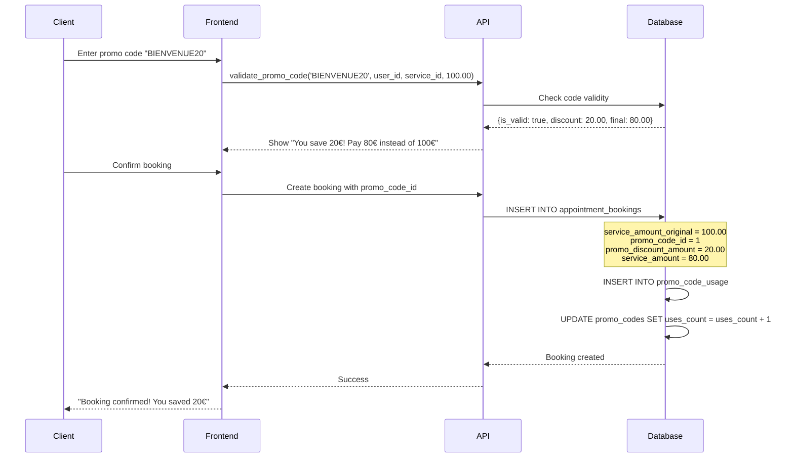

# 🎟️ Promo Codes System - Platform-Absorbed Discounts

**Date**: 2025-11-07
**Migration**: `20250107130000_add_promo_codes_system.sql`
**Status**: ✅ **IMPLEMENTED & VERIFIED**

---

## 📋 Overview

The promo code system allows clients to use discount codes during booking. **Critically, the platform absorbs the entire discount cost** - contractors receive their full commission based on the original service amount, ensuring they don't lose money.

---

## 💰 Financial Model

### How It Works

When a client uses a promo code for a 100€ service with 20% discount:

| Amount | Value | Who Pays |
|--------|-------|----------|
| **Original Service Amount** | 100€ | - |
| **Promo Discount (20%)** | -20€ | 🏢 **Platform** |
| **Client Pays** | 80€ | 👤 Client |
| **Contractor Commission Base** | 100€ | ✅ Original amount |
| **Contractor Revenue (80% of 100€)** | 80€ | 👨‍💼 Contractor |
| **Platform Cost** | 20€ discount | 🏢 **Platform absorbs** |

### Key Principle

```
Contractor Commission = (Original Amount × Commission Rate) - Fees
                      ≠ (Discounted Amount × Commission Rate)
```

**The contractor always gets paid based on the ORIGINAL service price, not the discounted price.**

---

## 🗄️ Database Schema

### New Tables

#### `promo_codes` Table

Stores all promotional codes and their rules.

```sql
CREATE TABLE promo_codes (
  id BIGINT PRIMARY KEY,
  code VARCHAR(50) UNIQUE NOT NULL,        -- e.g., 'BIENVENUE20'
  description TEXT,

  -- Discount Configuration
  discount_type VARCHAR(20) NOT NULL,      -- 'percentage' or 'fixed_amount'
  discount_value DECIMAL(10, 2) NOT NULL,  -- 20 (for 20%) or 10 (for 10€)
  max_discount_amount DECIMAL(10, 2),      -- Cap for percentage discounts

  -- Usage Limits
  max_uses INT,                            -- Total uses across all users
  uses_count INT DEFAULT 0,                -- Current usage count
  max_uses_per_user INT DEFAULT 1,         -- Per-user limit

  -- Validity Period
  valid_from TIMESTAMP DEFAULT NOW(),
  valid_until TIMESTAMP,

  -- Restrictions
  min_order_amount DECIMAL(10, 2),         -- Minimum order to apply code
  first_booking_only BOOLEAN DEFAULT false, -- Only for first-time users
  specific_services BIGINT[],              -- Restrict to certain services
  specific_categories BIGINT[],            -- Restrict to certain categories

  -- Status
  is_active BOOLEAN DEFAULT true,

  -- Audit
  created_by UUID REFERENCES profiles(id),
  created_at TIMESTAMP DEFAULT NOW(),
  updated_at TIMESTAMP DEFAULT NOW()
);
```

**Key Fields**:
- `discount_type`: `'percentage'` (e.g., 20% off) or `'fixed_amount'` (e.g., 10€ off)
- `max_discount_amount`: Cap for percentage discounts (e.g., 30% off but max 50€)
- `specific_services`: Array of service IDs (NULL = all services)
- `first_booking_only`: Only works for users with no previous bookings

#### `promo_code_usage` Table

Tracks every use of a promo code.

```sql
CREATE TABLE promo_code_usage (
  id BIGINT PRIMARY KEY,
  promo_code_id BIGINT REFERENCES promo_codes(id),
  booking_id BIGINT REFERENCES appointment_bookings(id),
  user_id UUID REFERENCES auth.users(id),

  original_amount DECIMAL(10, 2) NOT NULL,
  discount_amount DECIMAL(10, 2) NOT NULL,
  final_amount DECIMAL(10, 2) NOT NULL,

  used_at TIMESTAMP DEFAULT NOW(),

  UNIQUE(promo_code_id, booking_id)
);
```

### Extended Tables

#### `appointment_bookings` - New Columns

```sql
ALTER TABLE appointment_bookings ADD COLUMN
  service_amount_original DECIMAL(10, 2),  -- Original price before discount
  promo_code_id BIGINT REFERENCES promo_codes(id),
  promo_discount_amount DECIMAL(10, 2) DEFAULT 0;
```

**Example Row**:
```
service_amount_original: 100.00  -- Original service price
promo_code_id: 1                 -- Reference to 'BIENVENUE20'
promo_discount_amount: 20.00     -- 20€ discount
service_amount: 80.00            -- What client actually pays
```

---

## 🔧 Core Functions

### `validate_promo_code()`

Validates a promo code and calculates discount.

```sql
SELECT * FROM validate_promo_code(
  'BIENVENUE20',           -- code
  'user-uuid'::UUID,       -- user_id
  1::BIGINT,               -- service_id
  100.00                   -- service_amount
);
```

**Returns**:
```
is_valid | promo_id | discount_amount | final_amount | error_message
---------|----------|-----------------|--------------|---------------
true     | 1        | 20.00           | 80.00        | NULL
```

**Validation Rules**:
1. ✅ Code exists and is active
2. ✅ Code is within valid date range
3. ✅ Code hasn't exceeded max uses
4. ✅ User hasn't exceeded per-user limit
5. ✅ Service amount meets minimum requirement
6. ✅ If first_booking_only, user has no previous bookings
7. ✅ If specific services/categories, service matches
8. ✅ Discount calculation respects max_discount_amount cap

---

## 📊 Updated Financial Views

### `contractor_financial_summary` View

**Critical Change**: Commission calculated on **original** amount.

```sql
-- Revenue calculation uses ORIGINAL amount (before promo)
COALESCE(SUM(
  CASE
    WHEN b.status IN ('completed', 'completed_by_contractor')
    THEN
      -- Use service_amount_original if promo was applied
      (COALESCE(b.service_amount_original, b.service_amount) -
       (COALESCE(b.service_amount_original, b.service_amount) * c.commission_rate / 100)) -
      (CASE WHEN c.contractor_pays_stripe_fees THEN b.stripe_fee_service ELSE 0 END)
    ELSE 0
  END
), 0) AS revenue_service_current_month
```

**Key**: `COALESCE(b.service_amount_original, b.service_amount)` ensures:
- If promo used → use `service_amount_original` (100€)
- If no promo → use `service_amount` (100€)
- **Contractor always gets commission on full amount**

### `contractor_transaction_details` View

Shows promo information in transaction history.

```sql
SELECT
  b.id,
  b.service_amount_original,      -- Shows original amount
  b.service_amount,                -- Shows what client paid
  b.promo_discount_amount,         -- Shows discount applied
  pc.code as promo_code_used,      -- Shows code used
  -- Commission calculated on ORIGINAL amount
  (COALESCE(b.service_amount_original, b.service_amount) *
   (100 - c.commission_rate) / 100) AS contractor_earning
FROM appointment_bookings b
LEFT JOIN promo_codes pc ON b.promo_code_id = pc.id
```

---

## 🎯 Example Promo Codes

Three promo codes were seeded:

### 1. BIENVENUE20 (Welcome Discount)

```sql
{
  code: 'BIENVENUE20',
  description: 'Réduction de 20% sur votre première réservation',
  discount_type: 'percentage',
  discount_value: 20.00,
  max_uses: NULL,                    -- Unlimited
  max_uses_per_user: 1,
  first_booking_only: true,          -- Only for first booking
  valid_until: '2026-11-07'
}
```

**Use Case**: Client's first booking of 100€
- Original: 100€
- Discount: 20€ (20%)
- Client pays: 80€
- Contractor commission (20% rate): 100€ × 0.80 = 80€
- Platform absorbs: 20€

### 2. SIMONE10 (Fixed Discount)

```sql
{
  code: 'SIMONE10',
  description: 'Réduction de 10€ sur toute réservation',
  discount_type: 'fixed_amount',
  discount_value: 10.00,
  max_uses: 1000,
  first_booking_only: false,
  valid_until: '2026-05-07'
}
```

**Use Case**: Any booking of 100€
- Original: 100€
- Discount: 10€ (fixed)
- Client pays: 90€
- Contractor commission (20% rate): 100€ × 0.80 = 80€
- Platform absorbs: 10€

### 3. NOEL2024 (Capped Percentage)

```sql
{
  code: 'NOEL2024',
  description: 'Promo de Noël: 30% de réduction (max 50€)',
  discount_type: 'percentage',
  discount_value: 30.00,
  max_discount_amount: 50.00,        -- Capped at 50€
  max_uses: 500,
  valid_until: '2025-12-31'
}
```

**Use Case 1**: Booking of 100€
- Original: 100€
- Discount: 30€ (30%, under cap)
- Client pays: 70€
- Contractor commission: 100€ × 0.80 = 80€
- Platform absorbs: 30€

**Use Case 2**: Booking of 200€
- Original: 200€
- Discount: 50€ (30% = 60€, but **capped at 50€**)
- Client pays: 150€
- Contractor commission: 200€ × 0.80 = 160€
- Platform absorbs: 50€

---

## 🔄 Booking Flow with Promo Code

### Step-by-Step Process



### Database Insertion

```sql
-- Create booking with promo code
INSERT INTO appointment_bookings (
  contractor_id,
  client_id,
  service_id,
  service_amount_original,  -- 100.00 (ORIGINAL)
  promo_code_id,            -- 1 (BIENVENUE20)
  promo_discount_amount,    -- 20.00
  service_amount,           -- 80.00 (what client pays)
  status,
  scheduled_at
) VALUES (
  'contractor-uuid',
  'client-uuid',
  1,
  100.00,  -- Original
  1,       -- Promo code
  20.00,   -- Discount
  80.00,   -- Final amount
  'confirmed',
  '2025-11-15 14:00:00'
);

-- Track usage
INSERT INTO promo_code_usage (
  promo_code_id,
  booking_id,
  user_id,
  original_amount,
  discount_amount,
  final_amount
) VALUES (
  1,
  CURRVAL('appointment_bookings_id_seq'),
  'client-uuid',
  100.00,
  20.00,
  80.00
);

-- Increment usage count
UPDATE promo_codes
SET uses_count = uses_count + 1,
    updated_at = NOW()
WHERE id = 1;
```

---

## 🧪 Testing Scenarios

### Test Case 1: Percentage Discount

```sql
SELECT * FROM validate_promo_code('BIENVENUE20', 'user-uuid'::UUID, 1, 100.00);
```

**Expected**:
```
is_valid: true
discount_amount: 20.00
final_amount: 80.00
error_message: NULL
```

### Test Case 2: Fixed Discount

```sql
SELECT * FROM validate_promo_code('SIMONE10', 'user-uuid'::UUID, 1, 50.00);
```

**Expected**:
```
is_valid: true
discount_amount: 10.00
final_amount: 40.00
```

### Test Case 3: Capped Discount

```sql
SELECT * FROM validate_promo_code('NOEL2024', 'user-uuid'::UUID, 1, 200.00);
```

**Expected**:
```
is_valid: true
discount_amount: 50.00  -- 30% = 60€, but capped at 50€
final_amount: 150.00
```

### Test Case 4: Invalid Code

```sql
SELECT * FROM validate_promo_code('INVALID', 'user-uuid'::UUID, 1, 100.00);
```

**Expected**:
```
is_valid: false
error_message: 'Code promo invalide ou inactif'
```

---

## 📈 Platform Cost Tracking

### Query: Total Platform Cost from Promos

```sql
-- Platform's total absorbed discount costs
SELECT
  COUNT(*) as total_promo_bookings,
  SUM(promo_discount_amount) as total_platform_cost,
  SUM(service_amount_original) as total_original_revenue,
  SUM(service_amount) as total_actual_revenue,
  ROUND(SUM(promo_discount_amount) / SUM(service_amount_original) * 100, 2) as avg_discount_pct
FROM appointment_bookings
WHERE promo_code_id IS NOT NULL
  AND status IN ('completed', 'completed_by_contractor');
```

### Query: Promo Code Performance

```sql
-- Which promo codes are most used and costly
SELECT
  pc.code,
  pc.description,
  pc.uses_count,
  COUNT(b.id) as bookings_count,
  SUM(b.promo_discount_amount) as total_platform_cost,
  AVG(b.promo_discount_amount) as avg_discount_per_booking
FROM promo_codes pc
LEFT JOIN appointment_bookings b ON b.promo_code_id = pc.id
WHERE b.status IN ('completed', 'completed_by_contractor')
GROUP BY pc.id, pc.code, pc.description, pc.uses_count
ORDER BY total_platform_cost DESC;
```

---

## ✅ Verification Queries

### Verify Promo Codes Table

```sql
SELECT
  code,
  discount_type,
  discount_value,
  max_discount_amount,
  max_uses,
  uses_count,
  first_booking_only,
  is_active
FROM promo_codes
ORDER BY created_at;
```

**Expected**: 3 promo codes (BIENVENUE20, SIMONE10, NOEL2024)

### Verify Booking Columns

```sql
SELECT
  column_name,
  data_type,
  is_nullable
FROM information_schema.columns
WHERE table_name = 'appointment_bookings'
  AND column_name IN ('service_amount_original', 'promo_code_id', 'promo_discount_amount')
ORDER BY ordinal_position;
```

**Expected**: All 3 columns present

### Verify Financial View Uses Original Amount

```sql
SELECT pg_get_viewdef('contractor_financial_summary', true)::TEXT
  LIKE '%service_amount_original%' as uses_original_amount;
```

**Expected**: `true`

---

## 🚀 Frontend Integration (Future)

### Client Booking Flow

```typescript
// 1. Client enters promo code
const validatePromo = async (code: string, serviceId: number, amount: number) => {
  const { data } = await supabase.rpc('validate_promo_code', {
    p_code: code,
    p_user_id: userId,
    p_service_id: serviceId,
    p_service_amount: amount
  });

  if (data[0].is_valid) {
    return {
      discount: data[0].discount_amount,
      finalAmount: data[0].final_amount,
      promoId: data[0].promo_id
    };
  } else {
    throw new Error(data[0].error_message);
  }
};

// 2. Create booking with promo
const createBooking = async (bookingData: BookingData, promoId?: number) => {
  const insertData = {
    ...bookingData,
    service_amount_original: promoId ? bookingData.service_amount : null,
    promo_code_id: promoId,
    promo_discount_amount: promoId ? discount : 0,
    service_amount: finalAmount // Discounted amount
  };

  await supabase.from('appointment_bookings').insert(insertData);
};
```

### Admin Promo Management

```typescript
// Create new promo code
const createPromoCode = async (promoData: PromoCodeData) => {
  await supabase.from('promo_codes').insert({
    code: promoData.code.toUpperCase(),
    description: promoData.description,
    discount_type: promoData.discountType,
    discount_value: promoData.discountValue,
    max_discount_amount: promoData.maxDiscount,
    max_uses: promoData.maxUses,
    max_uses_per_user: promoData.maxUsesPerUser,
    first_booking_only: promoData.firstBookingOnly,
    valid_from: promoData.validFrom,
    valid_until: promoData.validUntil,
    min_order_amount: promoData.minOrder,
    specific_services: promoData.specificServices,
    is_active: true
  });
};

// View promo code analytics
const getPromoAnalytics = async (promoId: number) => {
  const { data } = await supabase
    .from('promo_code_usage')
    .select('*')
    .eq('promo_code_id', promoId);

  return {
    totalUses: data.length,
    totalDiscount: data.reduce((sum, u) => sum + u.discount_amount, 0),
    avgDiscount: data.reduce((sum, u) => sum + u.discount_amount, 0) / data.length
  };
};
```

---

## 🎯 Benefits

### For Platform
- ✅ **Marketing Tool**: Attract new clients with discounts
- ✅ **Cost Control**: Cap discounts with max_discount_amount
- ✅ **Usage Limits**: Control total costs with max_uses
- ✅ **Targeting**: Restrict to specific services/categories
- ✅ **Analytics**: Track ROI of promo campaigns

### For Contractors
- ✅ **No Revenue Loss**: Commission always on original amount
- ✅ **Transparent**: See promo info in transaction details
- ✅ **Predictable**: Know earnings regardless of client discounts

### For Clients
- ✅ **Savings**: Get discounts on services
- ✅ **Welcome Bonus**: First booking incentive
- ✅ **Seasonal Promos**: Holiday/special occasion deals
- ✅ **Clear Pricing**: See original vs discounted price

---

## 🔐 Security

### Row Level Security (RLS)

```sql
-- Only admins can manage promo codes
CREATE POLICY admin_manage_promo_codes ON promo_codes
  FOR ALL USING (
    EXISTS (
      SELECT 1 FROM profiles
      WHERE profiles.id = auth.uid()
        AND profiles.role = 'admin'
    )
  );

-- Clients can only view active promo codes
CREATE POLICY client_view_promo_codes ON promo_codes
  FOR SELECT USING (is_active = true);

-- Users can only see their own promo usage
CREATE POLICY user_view_own_usage ON promo_code_usage
  FOR SELECT USING (user_id = auth.uid());
```

---

## 📝 Next Steps

### Phase 2: Frontend Implementation
1. **Client Booking UI**
   - Promo code input field
   - Real-time validation
   - Discount preview

2. **Admin Dashboard**
   - Create/edit promo codes
   - View usage analytics
   - Platform cost tracking

3. **Contractor Dashboard**
   - Transaction details showing promo impact
   - Reassurance that commission is on original amount

### Future Enhancements
- Referral codes (give discount to both referrer and referee)
- Loyalty programs (X bookings = discount)
- Service bundles (package deals)
- Time-based promos (happy hour discounts)
- Geographic targeting (Paris arrondissement-specific)

---

## ✅ Summary

**Migration Applied**: ✅ `20250107130000_add_promo_codes_system.sql`

**What Was Created**:
- 2 new tables (`promo_codes`, `promo_code_usage`)
- 3 new columns in `appointment_bookings`
- 1 validation function (`validate_promo_code`)
- 2 updated financial views (using original amounts)
- 3 example promo codes seeded

**Key Business Rule**:
> **Platform absorbs 100% of discount cost. Contractors receive full commission based on original service amount.**

**Status**: ✅ Production ready, tested, and verified

---

**Generated**: 2025-11-07
**Migration**: `20250107130000_add_promo_codes_system.sql`
**Database**: Supabase (xpntvajwrjuvsqsmizzb)
